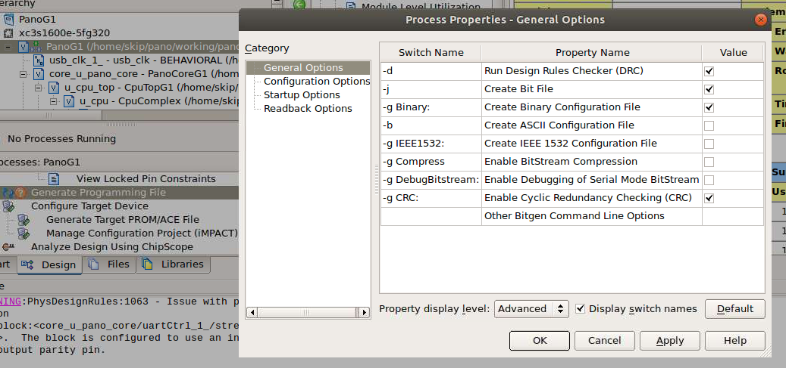
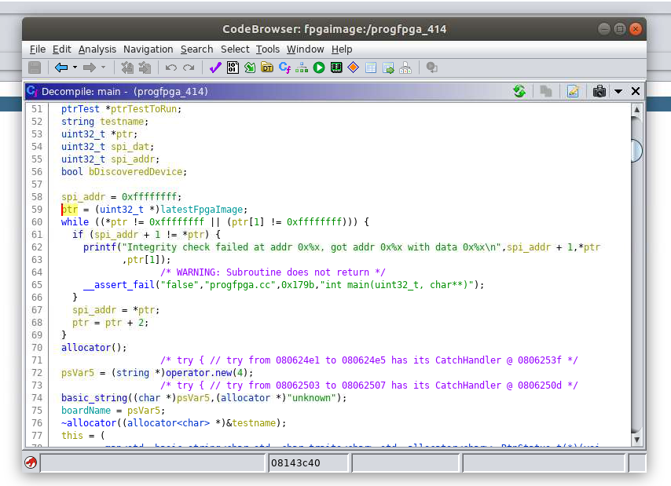
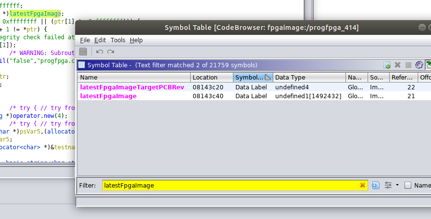

## Flashing Pano Logic G1 devices without a programmer

This project updates the Xilinx image embedded in the Panologic's progfpga programmer utility with a new user provided image.

Why?

Using a JTAG or SPI programmer to update the flash in a Pano requires the investment in a programmer and requires disassembling the Pano to gain access to the programming connectors.  Sometimes a more convenient method is handy.

If you are one of those that picked up a Pano but never got around to doing anything with it now is your chance.  Dig your Pano out of your garage, checkout [Tom's Raytracer](https://github.com/tomverbeure/rt), or my [pano_man](https://github.com/skiphansen/pano_man) or one of the other pano projects and give it a try.

While a JTAG programmer is certainly a requirement for development progfpga provides a fast and easy way to load your latest creation on to a Pano device for whatever reason.

Warning: No known images other than the original Pano Logic image implement Pano's protocol so this is a one way update.  There is no way to recover the Pano without a JTAG or SPI programmer after flashing a new image. 

## What is a Pano Logic device and why do I care?

Pano Logic was a Bay Area startup that manufactured tiny thin clients that were connected to a central server.   The Pano devices have a Ethernet interface, a few USB ports, audio input and output ports, and one or two video ports.

The first generation (G1) Pano was based on the largest Xilinx Spartan-3E family chip and supported a single VGA monitor.

The second generation (G2) supported two DVI monitors. Revision A and B of the G2 devices were based on the Spartan-6 LX150 which is the largest chip in the family.  The revision C G2 device is based on the smaller LX100 device which is still quite large by hobbist standards.

Unfortunately for Pano Logic, but fortunate for FPGA hobbists Pano Logic when out of business in 2012.  Shortly thereafter **TONS** of both new and used Pano Logic devices started showing up on ebay for very little money since they were pretty much useless without support.  Even today (April 2019) both versions of the Paro Logic devices are still  readily available on ebay for little.

Tom Verbeure has spent a lot of time reverse engineering the Paro Logic devices and created a absolute mind blowing raytracing demo that runs on a G1 device.  It was the [Hackaday article](https://hackaday.com/2018/12/07/racing-the-beam-on-a-thin-client-in-fpgas/) article on his project that originally attracted my attention to the Pano hacking scene.

Tom's article also got the attention of Wenting Zhang who added support for the G1's SDRAM and USB controller as well as making it possible to execute code on a soft processor directly from the SPI flash.  I can't wait until he finishes porting his [Verilog Boy](https://hackaday.io/project/57660-verilogboy-gameboy-on-fpga) project to the Pano.


## Progfpga requirements
Progfpga is a 32 bit Linux x86 program that can be run on any OS that can run 32 bit Linux binaries.  The Pano provided VM is fine if you don't mind a 4.4 gigabyte download that expands to 14 gigabytes when imported.  

I copied the progfpga command utility to my 64 bit Ubuntu 18.04 system and had no problems running it after I installed [32 bit libraries](https://linuxconfig.org/unable-to-find-a-suitable-destination-to-install-32-bit-compatibility-libraries-on-ubuntu-18-04-bionic-beaver-linux).

The orignal Pano progfpga utility is provided in this repository to save you the hassle of downloading the VM.  Surprisingly no copyright notices appears in any of the source code or utilities in the Pano VM, nor is there a click though license agreement.

If you want to go the VM route start [here](https://www.youtube.com/watch?v=DPkF5EisGDQ), or create a 32 bit Linux VM of your choice.


## Patching progfpga
1. Build the patch program.
2. Copy progfpga into the current directory.
3. Run patch_progfpga giving it the path to the binary Xilinx image file to embed into progfpga.

```
skip@dell-790:~/pano/working/pano_progfpga$ make
cc     patch_progfpga.c   -o patch_progfpga
skip@dell-790:~/pano/working/pano_progfpga$ cp series1/progfpga .
skip@dell-790:~/pano/working/pano_progfpga$ ./patch_progfpga ../pano_man/xilinx/Pano.bin
progfpga updated successfully with ../pano_man/xilinx/Pano.bin
skip@dell-790:~/pano/working/pano_progfpga$
```
## Flashing the image over the network

Flashing a Pano device with the patched progfpga utility is exactly the same is as explained in Pano video, namely:
1. Plug the Pano into your local LAN.
2. Turn it on.
3. Discover it's IP address.
4. Update it.
5. Cross your fingers and wait as the Pano is updated.
6. Power cycle the Pano and enjoy your new image.
```

skip@dell-790:~/pano/working/pano_progfpga$ ./progfpga -d
Running Test = discover
IP ADDRESS        SUBNET MASK       GATEWAY ADDRESS   MAC ADDRESS       REVISION
192.168.123.166   255.255.255.0     192.168.123.1     00-1c-02-63-71-62 4.14
192.168.123.166   255.255.255.0     192.168.123.1     00-1c-02-63-71-62 4.14
192.168.123.166   255.255.255.0     192.168.123.1     00-1c-02-63-71-62 4.14
192.168.123.166   255.255.255.0     192.168.123.1     00-1c-02-63-71-62 4.14
192.168.123.166   255.255.255.0     192.168.123.1     00-1c-02-63-71-62 4.14
Test has PASSED
skip@dell-790:~/pano/working/pano_progfpga$ ./progfpga 192.168.123.166
Running Test = flashlatestfpga
Client connected : IP Addr = 192.168.123.166:8321
READ CFG reg 0: 0x00050000
TESTING with board Type = RevC
FPGA Major Rev = 0004, Minor Rev = 000e
S3E(RevC) board
Initializing DDR...
READ DATA @ 0x2009: 0x00000032
READ DATA @ 0x2005: 0x00000000
READ DATA @ 0x200a: 0x00000000
READ DATA @ 0x200b: 0x00000032
READ DATA @ 0x200c: 0x00000000
READ DATA @ 0x200d: 0x00000000
READ DATA @ 0x200e: 0x00000000
READ DATA @ 0x200f: 0x00000000
READ DATA @ 0x2004: 0x00000000
READ DATA @ 0x2008: 0x00000000
DDR init done
Detected FPGA with new SPI flash controller.SPI ERASE SECTOR 00000000
SPI ERASE SECTOR 00004000
SPI ERASE SECTOR 00008000
SPI ERASE SECTOR 0000c000
SPI ERASE SECTOR 00010000
SPI ERASE SECTOR 00014000
SPI ERASE SECTOR 00018000
SPI ERASE SECTOR 0001c000
SPI ERASE SECTOR 00020000
SPI ERASE SECTOR 00024000
SPI ERASE SECTOR 00028000
SPI ERASE SECTOR 0002c000
SPI ERASE SECTOR 00030000
SPI ERASE SECTOR 00034000
Quick Erase Check: ..............PASSED
Image Programing
Image had 186553 words, last address written 0x0002d8b8
reading flash & verifing
Image Verified
Done Programming - power cycle to take effect
Test has PASSED
Disconnecting audio...
Disconnected
skip@dell-790:~/pano/working/pano_progfpga$
```
## Preparing a binary image
We need a **BINARY** fpaga image (not a .bit file) for progfpga.  One can be created at the same time as the .bit file by checking the *Create Binary Configuration File* option in process properties the for the Generate Programming File process.

 .

After running the *Generate Programming File* process a .bin file should be created in the same subdirectory as the .bit file.
## Background

When Pano Logic was still alive they published a number of help videos on youtube including [this video](https://www.youtube.com/watch?v=DPkF5EisGDQ) which describes the FPGA image update process.  The 21 minute video directs one to a CentOS 4.5 Linux P2V virtual machine which amazingly was still downloadable in 2019 from [here](https://www.youtube.com/redirect?q=https%3A%2F%2Fdocs.google.com%2Ffile%2Fd%2F0B9fxMMbyahDFS3h6QnJWak9xTEE%2Fedit%3Fusp%3Dsharing&event=video_description&v=DPkF5EisGDQ&redir_token=KhUbBOXL2w_m-aFI04GCf7ckh4l8MTU1NTI3MjQxNEAxNTU1MTg2MDE0).

When I downloaded and ran the VM I found a treasure load of information on the Pano as well as the update utilities described in the video. I even found some **source code!**  Apparently the VM was created from a system that has been used for developing code to burn-in and test Pano devices.

Following the directions in the video I had no problem updating one of my Pano G1 devices, to the "current" Pano Logic firmware, but that wasn't my goal, I wanted to flash my own firmware. 

My hope when I downloaded the VM was that the flash utility updated the Pano using a .bit file from somewhere, but I had no luck finding one.

Since I had been wanting to play with the NSA's [Ghidra](https://ghidra-sre.org/) reverse engineering tool anyway the Pano Logic flash update tool provided a perfect excuse.

Once I watched the introductory video to help me learn the slightly non-intuitive UI it didn't take long to find where the image was coming from.  It's embedded in the application in a somewhat odd format.

 

The memory address of latestFpgaImage is found in the Symbol Table window.



I couldn't figure out how to get Ghidra to tell me where latestFpgaImage was located in the program file but that information is easily available from objdump:
```
skip@dell-790:~/pano/working/pano_progfpga$ objdump -h progfpga | grep "\.data
 24 .data         001796d4  08143c00  08143c00  000fbc00  2**5*
```

Knowing this we can calculate that we need to patch offset 0x8143c40 - 0x08143c00 + 0x000fbc00 in the program file.

All that remained was writing a program to update the updater with a new image.

## Pano Links

[Original Hackaday](https://hackaday.com/2013/01/11/ask-hackaday-we-might-have-some-fpgas-to-hack/) article from 2013.
Hackady article on Tom's [Raytracker](https://hackaday.com/2018/12/07/racing-the-beam-on-a-thin-client-in-fpgas/).
Hackaday article on my [Pacman](https://hackaday.com/2019/01/11/pac-man-fever-comes-to-the-pano-logic-fpga/) project.
Hackaday article on Tom's [Joystick adapter](https://hackaday.com/2019/02/11/two-joysticks-talk-to-fpga-arcade-game-over-a-vga-cable/).

G1 reverese engineering information:
https://github.com/tomverbeure/panologic
G1 [Schematics!](https://github.com/twj42/PanoLogicG2_ReverseEngineering/blob/master/files/G1_Schematics.zip)

G2 reverse engineering information:
https://github.com/tomverbeure/panologic-g2
https://twj42.github.io/PanoLogicG2_ReverseEngineering/
